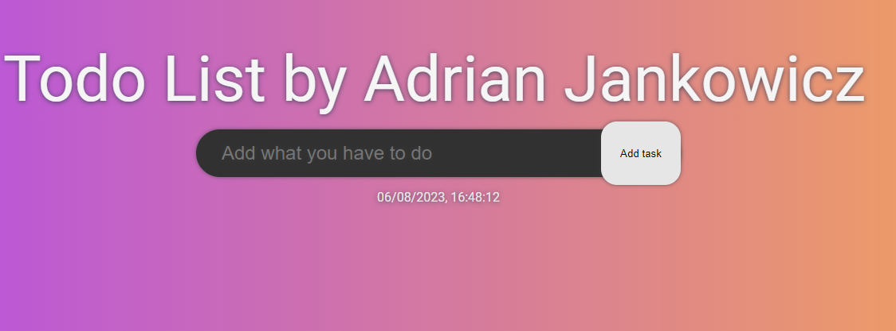
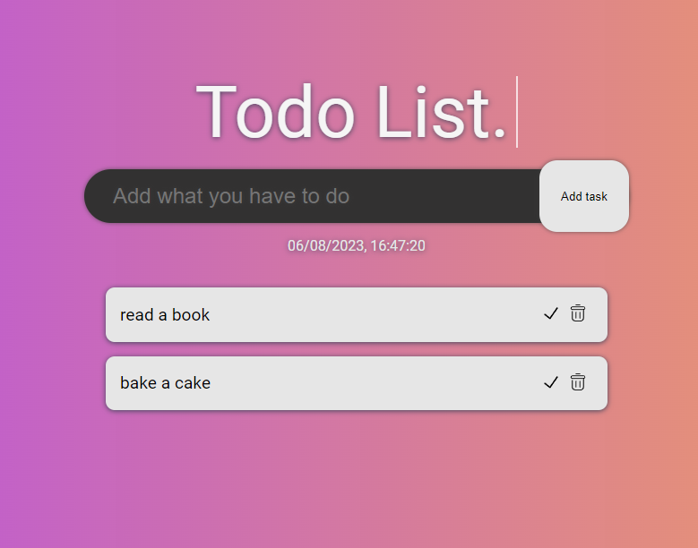
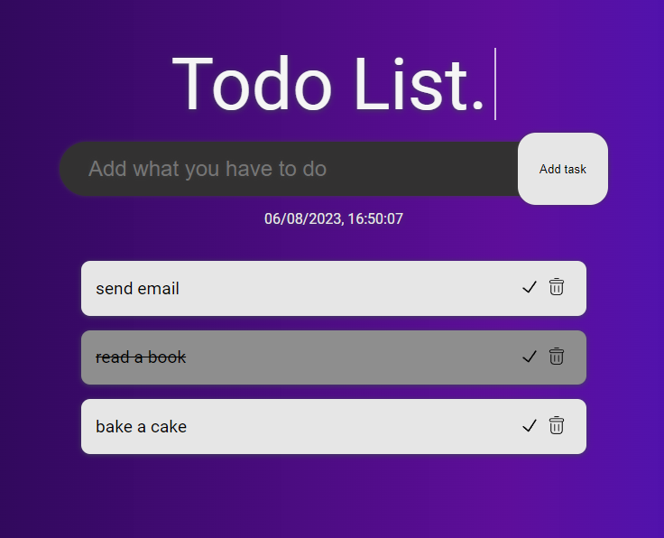

# Todo List

## English below

## Opis

To prosta, ale potężna aplikacja do zarządzania listą zadań, która pozwala efektywnie zarządzać Twoimi zadaniami. Możesz dodawać, oznaczać jako wykonane i usuwać zadania. Aplikacja posiada również tryb ciemny, który jest łatwy dla oczu podczas nocnej pracy.

## Technologie

- HTML
- CSS
- JavaScript

## Instalacja

Aby zainstalować i uruchomić ten projekt, po prostu sklonuj to repozytorium i otwórz `index.html` w preferowanej przez siebie przeglądarce internetowej. Nie są potrzebne żadne dodatkowe kroki instalacji, ponieważ aplikacja jest całkowicie po stronie klienta.

## Jak korzystać

1. Wpisz swoje zadanie w polu tekstowym.
2. Kliknij 'Dodaj zadanie' lub naciśnij Enter, aby dodać zadanie do listy.
3. Kliknij przycisk z symbolem zatwierdzenia, aby oznaczyć zadanie jako wykonane.
4. Kliknij przycisk z symbolem kosza, aby usunąć zadanie z listy.
5. Użyj kolorowego kółka w nagłówku, aby przełączyć pomiędzy trybem jasnym i ciemnym.

## English

## Description

This is a simple but powerful Todo List web application that allows you to manage your tasks effectively. You can add, mark as done, and remove tasks. It also features a dark mode to make it easy on the eyes during late-night work.

## Tech Stack

- HTML
- CSS
- JavaScript

## Installation

To install and run this project, simply clone this repository and open `index.html` in your preferred web browser. No additional installation steps are necessary as the application is entirely client-side.

## Usage

1. Write your task in the input field.
2. Click 'Add task' or press Enter to add the task to the list.
3. Click on the check button to mark the task as done.
4. Click on the delete button to remove the task from the list.
5. Use the color circle in the header to switch between light and dark mode.

[MIT](https://choosealicense.com/licenses/mit/)

